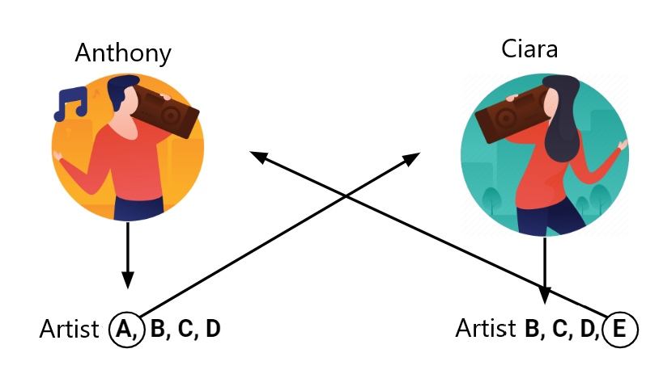

<h1 align="center">
  
  <br/>
  Artist Recommendation System (CA4015)
</h1>
<h3 align="center">
  Anthony Reidy, 18369643.
  <br/><br/><br/>
</h3>

## Table of Contents
- [Google Colab links](#google-colab)
- [Github Link](#github-link)
- [Development](#development)
- [Usage](#usage)
- [Website](#website)

## Google Colab
The notebooks in our jupyter book are also available on Google Colab:
- 
-
-


## Github Link
The github link for my assignment is  https://github.com/reidya3/MusicArtistRecommendationSystem 

## Development
It is good practice to develop in a virtual environment. Note, this jupyter book was written using `python 3.8` and on the `Ubuntu` (Linux) operating system (OS). As such, all commands are setup for this installation and may not work for other OS's. To create a virtual environment called `venv`, execute:
```bash
python3 -m venv venv
```
To activate it, execute
```bash
source venv/bin/activate
```

- Execute `pip install -r requirements.txt` to install requirements for development.

## Usage
To build the jupyter book as HTML, please execute `jupyter-book build --all book/`. 

We use latex to build a PDF of our book for this investigation. On Ubuntu, please install the following prerequisite packages:
```bash
sudo apt-get install texlive-latex-recommended texlive-latex-ie \
                     texlive-fonts-recommended texlive-fonts-extra \
                     texlive-xetex latexmk
```
Next, to build a PDF of the project, please use the following command `jupyter-book build  book/ --builder pdflatex`. **Note**, you will have to build a html version first. 

For further information on how to accomplish this on other OS's, please [click here](https://jupyterbook.org/advanced/pdf.html?highlight=build%20pdf). The **PDF file** can be found in the [docs](/docs) folder.

## Website
The content of this jupyter book is [hosted here](https://reidya3.github.io/CA4015_First_Assignment/Introduction.html). Github actions are utilized to automatically build the book and update the website when a `push` or `pull request` event occurs on the main branch.